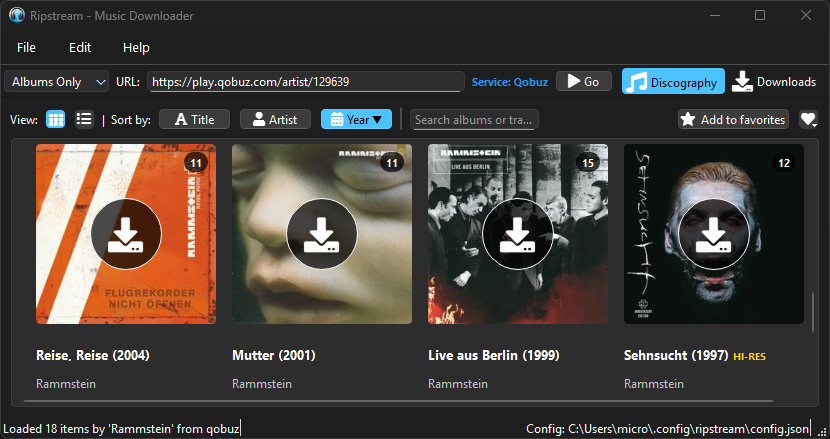

<div align="center">
  

  # Ripstream - Music Downloader

  *A modern, cross-platform music downloading application supporting multiple streaming services*

  [](https://opensource.org/licenses/MIT)
  [](https://www.python.org/downloads/)
  [](https://www.riverbankcomputing.com/software/pyqt/)
</div>

<div align="center">
  
</div>

## Overview

Ripstream is a comprehensive music downloading application built with modern Python and PyQt6. It provides a user-friendly interface for downloading high-quality music from various streaming services, with support for metadata tagging, artwork embedding, and organized file management.

## ✨ Key Features

### 🎵 Multi-Service Support
- **Qobuz**: Full support with high-quality downloads (up to 24-bit/192kHz)
- **Tidal**: Artist, album, and track downloads
- **Deezer**: Complete catalog access
- **Spotify**: URL parsing and metadata extraction
- **Apple Music**: URL recognition and processing
- **YouTube Music**: Video and audio content
- **SoundCloud**: Track and playlist support

### 🖥️ Modern GUI Interface
- **PyQt6-based** modern desktop application
- **Dual-view system**: Grid and List views for browsing content
- **Real-time progress tracking** with download statistics
- **Responsive design** with intuitive navigation
- **Dark/Light theme support** (configurable)

### 🎯 Smart URL Processing
- **Intelligent URL parsing** for all supported services
- **Automatic service detection** from URLs
- **Content type recognition** (artist, album, track, playlist)
- **Batch processing** for multiple URLs

### 📱 Content Discovery & Management
- **Artist discography browsing** with album artwork
- **Album track listings** with detailed metadata
- **Playlist management** and organization
- **Search functionality** across all content types
- **Download history** with retry capabilities

### 🎧 High-Quality Audio Downloads
- **Lossless audio support** (FLAC, ALAC)
- **Multiple quality levels**: Low (128kbps) to Hi-Res (24-bit/192kHz)
- **Format flexibility**: MP3, FLAC, M4A support
- **Concurrent downloads** with configurable limits

### 🏷️ Advanced Metadata & Tagging
- **Comprehensive metadata extraction** from streaming services
- **Automatic audio file tagging** with Mutagen
- **Artwork embedding** in multiple formats (FLAC, MP3, M4A)
- **Custom metadata fields** and organization
- **ISRC and catalog number support**

### 📁 Intelligent File Organization
- **Customizable folder structures** (Artist/Album/Track)
- **Source-specific subdirectories** (optional)
- **Multi-disc album handling** with disc folders
- **Safe filename generation** with character sanitization
- **Duplicate detection** and handling

### ⚙️ Comprehensive Configuration
- **Service authentication** management
- **Download behavior** customization
- **Audio quality** preferences per service
- **Network settings** (SSL verification, rate limiting)
- **Advanced options** for power users

### 🔄 Robust Download Management
- **Download queue** with priority handling
- **Automatic retry logic** with exponential backoff
- **Progress tracking** with speed and ETA calculations
- **Error handling** with detailed logging
- **Resume capability** for interrupted downloads

## 🚀 Installation

### Prerequisites
- Python 3.12 or higher
- PyQt6 for the GUI interface
- Required Python packages (see requirements.txt)

### Quick Install
```bash
# Clone the repository
git clone https://github.com/your-username/ripstream.git
cd ripstream

# Install dependencies
pip install -r requirements.txt

# Run the application
python main.py
```

### Development Setup
```bash
# Install development dependencies
pip install -r requirements-dev.txt

# Install pre-commit hooks
pre-commit install

# Run tests
pytest tests/
```

## 🎮 Usage

### Basic Usage
1. **Launch the application**: `python main.py`
2. **Enter a URL**: Paste any supported streaming service URL
3. **Browse content**: Switch between Grid and List views
4. **Download**: Click download buttons on desired content
5. **Monitor progress**: Check the Downloads tab for status

### Supported URL Formats
```
# Qobuz
https://open.qobuz.com/artist/123456
https://open.qobuz.com/album/abcdef123456
https://open.qobuz.com/track/789012

# Tidal
https://listen.tidal.com/artist/123456
https://listen.tidal.com/album/123456
https://listen.tidal.com/track/123456

# Spotify
https://open.spotify.com/artist/4Z8W4fKeB5YxbusRsdQVPb
https://open.spotify.com/album/4aawyAB9vmqN3uQ7FjRGTy
https://open.spotify.com/track/4iV5W9uYEdYUVa79Axb7Rh

# And more...
```

### Configuration
Access preferences through **Edit → Preferences** to configure:
- **Service credentials** (email/password or tokens)
- **Download locations** and folder structures
- **Audio quality** preferences
- **Network settings** and rate limits
- **Advanced options** for metadata and tagging

## 🏗️ Architecture

### Core Components

#### URL Parser (`src/ripstream/core/url_parser.py`)
- Intelligent URL parsing for all streaming services
- Service detection and content type identification
- Metadata extraction from URL parameters

#### Downloader Framework (`src/ripstream/downloader/`)
- **Base downloader** with common functionality
- **Service-specific implementations** (Qobuz, Tidal, etc.)
- **Progress tracking** and error handling
- **Queue management** for batch downloads

#### UI System (`src/ripstream/ui/`)
- **Main window** with menu system and navigation
- **Discography views** (Grid and List)
- **Downloads management** with statistics
- **Preferences dialog** with tabbed configuration

#### Models (`src/ripstream/models/`)
- **Pydantic-based** data models for type safety
- **Artist, Album, Track, Playlist** representations
- **Database integration** with SQLAlchemy
- **Factory patterns** for service-specific data

#### Metadata System (`src/ripstream/metadata/`)
- **Artwork downloading** and processing
- **Audio file tagging** with comprehensive metadata
- **Format-specific** tagging (FLAC, MP3, M4A)

### Design Principles
- **Single Responsibility**: Each module has a focused purpose
- **Type Safety**: Full type hinting with Pydantic validation
- **Extensibility**: Plugin-friendly architecture for new services
- **Error Handling**: Comprehensive exception handling and logging
- **Testing**: Extensive test coverage for reliability

## 🔧 Configuration Options

### Service Configuration
```python
# Qobuz settings
qobuz:
  email: "your-email@example.com"
  password: "your-password"
  quality: "lossless"  # low, high, lossless, hi_res

# Download settings
downloads:
  folder: "/path/to/music"
  source_subdirectories: false
  disc_subdirectories: true
  max_connections: 6
  requests_per_minute: 60
```

### Audio Quality Levels
- **Low**: ~128 kbps MP3
- **High**: ~320 kbps MP3
- **Lossless**: CD quality FLAC (16-bit/44.1kHz)
- **Hi-Res**: High resolution FLAC (24-bit/96kHz+)

## 🧪 Testing

The application includes comprehensive tests:

```bash
# Run all tests
pytest tests/

# Run specific test categories
pytest tests/ui/          # UI component tests
pytest tests/downloader/  # Downloader tests
pytest tests/models/      # Model validation tests
pytest tests/metadata/    # Metadata processing tests

# Run with coverage
pytest --cov=src tests/
```

## 📝 Development

### Project Structure
```
ripstream/
├── main.py                 # Application entry point
├── src/ripstream/          # Main source code
│   ├── config/            # Configuration management
│   ├── core/              # Core utilities (URL parsing, etc.)
│   ├── downloader/        # Download framework
│   ├── metadata/          # Metadata and tagging
│   ├── models/            # Data models
│   └── ui/                # User interface
├── tests/                 # Test suite
├── examples/              # Usage examples
└── images/                # Application assets
```

### Adding New Services
1. Create service-specific downloader in `src/ripstream/downloader/providers/`
2. Implement URL patterns in `src/ripstream/core/url_parser.py`
3. Add service configuration in `src/ripstream/config/services.py`
4. Create metadata provider in `src/ripstream/ui/metadata_providers/`
5. Add comprehensive tests

### Code Style
- **Python 3.12+** with modern type hints
- **Ruff** for linting and formatting
- **Pre-commit hooks** for code quality
- **Pydantic** for data validation
- **Comprehensive docstrings** for all public APIs

## 📦 Packaging & Distribution

### Building Standalone Executable

Ripstream can be packaged into a standalone executable for easy distribution to end users who don't have Python installed.

#### Quick Build
```bash
# Automated build (recommended)
python build.py

# Or on Windows
build.bat
```

#### Manual Build
```bash
# Using PyInstaller directly
pyinstaller ripstream.spec --clean
```

#### Output
- **`dist/Ripstream.exe`** (~55MB): Standalone executable
- **`dist/README.txt`**: User instructions

#### Features
- **Single file**: Everything bundled into one executable
- **No dependencies**: Python runtime and all packages included
- **Application icon**: Embedded icon for Windows
- **Optimized size**: Excludes unnecessary modules
- **Ready to distribute**: Users can run directly

For detailed packaging information, see [`PACKAGING.md`](PACKAGING.md).

## 🤝 Contributing

We welcome contributions! Please see our contributing guidelines:

1. **Fork the repository** and create a feature branch
2. **Follow code style** guidelines (Ruff formatting)
3. **Add tests** for new functionality
4. **Update documentation** as needed
5. **Submit a pull request** with clear description

### Development Workflow
```bash
# Setup development environment
git clone https://github.com/your-username/ripstream.git
cd ripstream
pip install -r requirements-dev.txt
pre-commit install

# Make changes and test
pytest tests/
ruff check src/ tests/
ruff format src/ tests/

# Submit pull request
git push origin feature-branch
```

## 📄 License

This project is licensed under the MIT License - see the [LICENSE](LICENSE) file for details.

## 🙏 Acknowledgments

- **streamrip**: Inspiration for the original concept
- **PyQt6**: Excellent GUI framework
- **Pydantic**: Type-safe data validation
- **Mutagen**: Audio metadata handling
- **aiohttp**: Async HTTP client

## 📞 Support

- **Issues**: [GitHub Issues](https://github.com/your-username/ripstream/issues)
- **Discussions**: [GitHub Discussions](https://github.com/your-username/ripstream/discussions)
- **Documentation**: [Wiki](https://github.com/your-username/ripstream/wiki)

---

<div align="center">
  <p><strong>Ripstream</strong> - Download music the modern way</p>
  <p>Copyright © 2025 ripstream and contributors</p>
</div>
